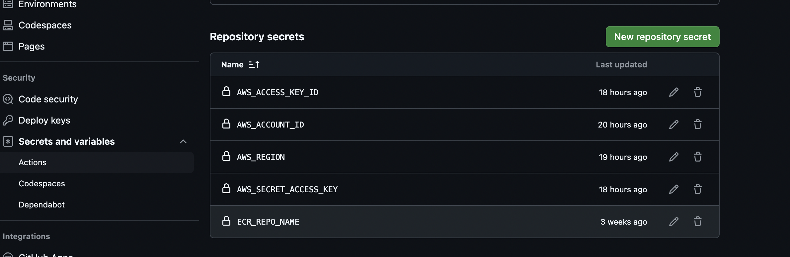

# DevOps Project With End to End workflow

### 1. Create eks cluster using eksctl command and Create ECR manually
```
eksctl create cluster -f eks-cluster.yaml  (takes around 10-15 mins)
```
### 2. Create Python files , Virtual env and related stuff.
```
pip install "fastapi[standard]"
pip freeze > requirements.txt 
```

### 3. Create dockerfile via Docker Init
```
docker init
```
### 4. Create Github Action for  Build ,Push Deploy.
```
pre-requisite is to setup aws credentials in Github repo 
Go To repo setting >> Secrets & Variables >> Actions >> New Repository Secrets.(see below pic)
```


### 5. Create k8s manifest file for deployment and service.


